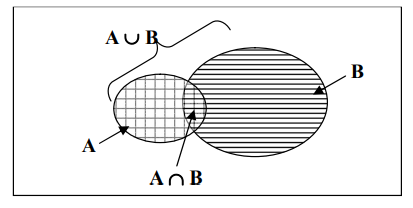
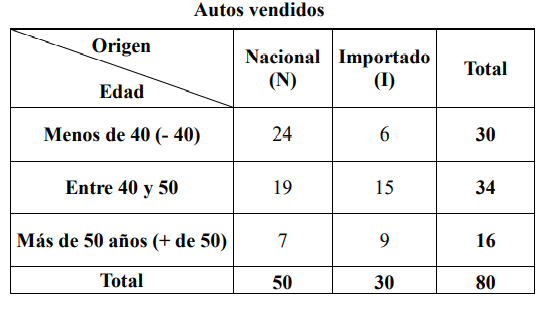

# ESPACIOS MUESTRALES Y SUCESOS

Los elementos básicos de la teoría de la probabilidad son los resultados de un experimento aleatorio. Un experimento es un ensayo o juego que puede constar de uno o más intentos y cuyo resultado es la ocurrencia de uno, y sólo uno de los varios resultados posibles y no se sabe cual ocurrirá.

Los siguientes son ejemplos de experimentos aleatorios porque cumplen con esas condiciones, acompañando en cada caso posibles resultados de la variable aleatoria a la cual dan origen: 

- Lugar de origen de los autos vendidos por la concesionaria: nacional e importado.<br>
- Edades de los compradores de auto de la concesionaria.<br>
- La forma de pago de un cliente: en efectivo, con tarjeta de crédito o con tarjeta de débito.<br>
- El precio de una acción en el mercado: aumente, permanezca sin cambios o disminuya.<br>
Los elementos básicos de la teoría de la probabilidad son los resultados individuales de una variable que se somete a estudio. Un evento o suceso es el conjunto de uno o más resultados de un experimento. El suceso o evento es un acontecimiento que puede ocurrir o no. 

## Clasificación de los sucesos:

- Simple: es un evento que puede describirse con una característica única. Ejemplos: el auto sea Nacional, el comprador tenga más de 40 años, el cliente pague con tarjeta de débito, el precio de la acción suba.<br>
- Compuesto: es un evento que puede describirse con más de una característica. Es una combinación de eventos simples. Ejemplo: el cliente de la concesionaria compre un auto nacional y tenga 40 años o más.

### Espacio muestral:
El espacio muestral es el conjunto de todos los resultados posibles de un experimento, la colección de todos los posibles eventos. La forma en que se subdivide el espacio muestral depende del tipo de probabilidades que se va a determinar.

Hay varias formas alternativas de observar un espacio muestral:
- Clasificación cruzada de los eventos en una tabla llamada tabla de contingencias o tabla 
de probabilidad.<br>
- Representación gráfica de los diversos eventos como uniones o intersecciones de círculos en un diagrama de Venn. 

Una tabla de contingencia es aquella en la que las filas figuran todos los resultados posibles de una de las características de la variable y en columnas todos los resultados posibles de otra característica de la variable, y en cada celda figura los sucesos o eventos conjuntos.<br>
La tabla de contingencias o probabilidades ofrece una representación clara del número de posibles resultados de la variable pertinente, en especial si hay dos o más sucesos o eventos que se consideran simultáneamente.


Un diagrama de Venn es una segunda forma de presentar un espacio muestral. Es un diagrama asociado con la teoría de conjuntos de las matemáticas en el cual se describen los eventos que pueden ocurrir en una observación o experimento en particular. Una figura cerrada representa el espacio muestral, mientras que porciones del área, dentro del espacio representan eventos simples o compuestos particulares. En el diagrama se representan gráficamente los eventos como “uniones” o “intersecciones” de círculos. 



### Sucesos Simples.

La probabilidad simple, es la probabilidad de ocurrencia de un suceso o evento simple P(A), suceso descrito por una sola característica, como la probabilidad de una comprador de 40 años o menos, la probabilidad de que se venda un auto nacional, la probabilidad de que un cliente pague en efectivo o con tarjeta de débito, la probabilidad de que una acción suba.

```python
#Probabilidad de que un comprador tenga 40 años.
sucesos = 30
total = 80
probalidad = sucesos / total
print(probabilidad)
```

Esta probabilidad se llama también probabilidad marginal, porque el número total de casos favorables se puede obtener en el margen apropiado de la tabla de contingencias.<br>
La probabilidad conjunta se aplica al fenómeno que contiene 2 o más eventos o sucesos, como la probabilidad de un comprador de auto importado y de más de 40.<br>
El evento conjunto “A y B”, significa que tanto el evento A, como el evento B, deben ocurrir en forma simultánea. Es el resultado de una celda en la tabla de contingencias.

```python
#Probabilidad de un comprador entre 40 y 50 años y auto importado
sucesos = 15
total = 80
probalidad = sucesos / total
print(probabilidad)
```
### Sucesos Excluyentes.
En una sola realización de un experimento aleatorio dos sucesos A y B son mutuamente excluyentes cuando no se pueden presentar simultáneamente, es decir, cuando la ocurrencia de uno cualquiera de ellos imposibilita la ocurrencia de los otros. Ejemplo: auto nacional o importado.<br>
Todos los sucesos opuestos son excluyentes, pero no todos los sucesos excluyentes son opuestos.<br>
Un conjunto de eventos es colectivamente exhaustivo si uno de los eventos debe ocurrir.<br>
Que el auto sea nacional o importado, son sucesos colectivamente exhaustivos. Uno de ellos debe ocurrir. Si no ocurre nacional, debe ocurrir importado y viceversa.<br>

### Sucesos Compatibles.
Dos sucesos son compatibles cuando pueden ocurrir al mismo tiempo. Ejemplo: nacional o más de 40 años. Esta definición no indica que estos sucesos deban necesariamente ocurrir en forma conjunta.<br>
Dos sucesos son compatibles cuando es posible que ocurran al mismo tiempo. Obsérvese que esta definición no indica que esos eventos deban ocurrir necesariamente en forma conjunta

Ejemplos:

- Sucesos pago en efectivo, con tarjeta de débito o con tarjeta de crédito son excluyentes.<br>
- Sucesos precio de la acción sube, precio de la acción baja, precio de la acción no cambia excluyentes.<br>
- Sucesos origen de los autos y edad de los compradores, según la tabla de contigencias.<br>



Si elegimos aleatoriamente un auto vendido, en este caso los sucesos:
- Auto Nacional (N) o Auto Importado (I) son excluyentes (no se presentan simultáneamente). <br>
- Edad del comprador: Menos de 40 años, entre 40 y 50 o Más de 50 (+ de 50) son excluyentes.<br>
- Auto Nacional (N) o Menos 40 años o menos (- 40) son compatibles (se presentan simultáneamente).<br>
- Auto Nacional (N) o Más de 50 años (+ de 50) son compatibles.<br>

En una sola realización de un experimento aleatorio se denomina ocurrencia conjunta de dos sucesos A y B, a su aparición simultánea.<br>
La ocurrencia conjunta se simboliza (A y B), también denominada como suceso intersección.<br>
Debe quedar claro a partir de esta definición, que en una sola realización de un experimento la aparición simultánea de dos sucesos A y B no es posible si ellos son excluyentes.<br>

En la selección de una venta:<br> 
- Los sucesos (N) e (I) son excluyentes, su ocurrencia conjunta nunca puede presentarse. Luego, en ese caso, la P(N e I) = 0.<br>
- Los sucesos Menos de 40 y Más de 50 son excluyentes, de modo que su ocurrencia conjunta nunca puede suceder.<br>
Por consiguiente la P( 40 y  de 50) = 0 .
- en cambio los sucesos (N) o (+ de 50) son compatibles, así que puede presentarse su ocurrencia conjunta. En ese caso la probabilidad se obtiene dividiendo los casos favorables, que figuran en la celda de intersección de la columna (N) con la fila (+ de 50) (7 autos vendidos), con los casos posibles, que son el número total de ventas, igual a 80. De esa forma P(N y + de 50) = 70/80.


## Regla de la adición: 
Se utiliza cuando se desea determinar la probabilidad de que ocurra un evento u otro o ambos en una sola observación. Nos permite encontrar la probabilidad del evento “A ó B”: considera la ocurrencia de cualquiera de los eventos, evento A o evento B o ambos A y B.<br>
### Probabilidad de que ocurra el evento A o el evento B

Para eventos mutuamente excluyentes: P(A o B) = P(A) + P(B) <br>


```python
#Probabilidad de que al seleccionar una venta el comprador tenga menos de 40 años o más 50 años.
menor40 = 30/80
mayor50 = 16/80
probalidad = menor40 + mayor50
print(probabilidad)
```

Para eventos compatibles, se resta a la suma de las probabilidades simples de los dos eventos, la probabilidad de ocurrencia conjunta:
 P(A o B) =  P(A) + P(B) – P(A y B)

```python
#Probabilidad de que al seleccionar una venta el comprador tenga más de 50 años o el auto sea importado

mayor50 = 16/80
importado = 30/80
mayor50importado = 9/80
probalidad = mayor50 + importado - mayor50importado
print(probabilidad)
```

En una sola realización de un experimento aleatorio, la probabilidad de ocurrencia de un suceso A, o de un suceso B, o de ambos simultáneamente, se resuelve mediante la suma de las probabilidades de ambos y la posterior resta de la probabilidad de su ocurrencia conjunta.

## Regla de la multiplicación:

### Sucesos Independientes
Dos eventos son independientes cuando la ocurrencia o no ocurrencia de un suceso o evento no tiene ningún efecto en la probabilidad de ocurrencia de otro suceso o evento.<br>
Cuando para dos sucesos o eventos cualquiera A y B la P(A/B)=P(A), ambos sucesos son independientes. 
En ese caso también ocurre que P(B/A)=P(B), y a partir de estas dos últimas igualdades, se verifica que, si A y B son independientes 
P(AyB) = P(A)*P(B).

Cuando se trata de la forma de pago: en efectivo, con tarjeta de débito o con tarjeta de crédito, y dos (o más) clientes se encuentran uno a continuación del otro en la cola de las cajas el suceso forma de pago que elija el primero es independiente del suceso forma de pago que elija el segundo (o los siguientes).

Si la probabilidad de que un cliente pague en efectivo (E) es 6/15, con tarjeta de crédito (TD) es 7/15 y con tarjeta de crédito (TC) es 2/15. Hallar la probabilidad de que dos clientes sucesivos que pagan sus cuentas lo hagan:<br>

```python
#Probabilidad de que dos clientes sucesivos, el primero pague en efectivo y el segundo con tarjeta de crédito. Estos sucesos son independientes

efectivo = 6/15
tarjetaCredito = 7/15
probalidad = efectivo * tarjetaCredito
print(probabilidad)

#Probabilidad de que dos clientes sucesivos, los dos paguen en efectivo:

efectivo = 6/15
probalidad = efectivo * efectivo
print(probabilidad)
```

### Sucesos Condicionales
Dos sucesos o eventos son condicionales cuando la ocurrencia o no ocurrencia de un suceso o evento afecta la probabilidad de ocurrencia del otro. Cuando calculamos la probabilidad de un suceso o evento A particular y tenemos información en cuanto a la ocurrencia de otro suceso o evento B, ésta probabilidad se denomina probabilidad condicional.<br>
Simbólicamente los sucesos condicionales se simbolizan mediante la expresión (A/B), que se lee el suceso A condicionado a la hipótesis que haya ocurrido B, o el suceso A dada la ocurrencia de B, o simplemente, el suceso A dado B.

La probabilidad de un suceso B condicionado a la previa ocurrencia de un suceso o evento particular A, se calcula dividiendo la cantidad de casos favorables a la ocurrencia conjunta de los sucesos o eventos A y B por la cantidad de casos posibles de ocurrencia del suceso o evento A. Ese cálculo también puede efectuarse dividiendo la probabilidad de la ocurrencia conjunta por la probabilidad del suceso o evento condicionante (en este caso, el suceso o evento I).

El concepto de sucesos condicionales también se aplica en la siguiente circunstancia: en dos (o más) realizaciones de un experimento aleatorio dos sucesos o eventos A y B son condicionales cuando la ocurrencia de uno de ellos en cualquier realización está afectada por la ocurrencia del otro en las restantes.<br>


En dos (o más) realizaciones de un experimento, la probabilidad de ocurrencia de un suceso A en primer lugar (simbolizado con A1) y de un suceso B en segundo lugar (simbolizado con B2), ambos independientes entre sí, se obtiene aplicando la fórmula de la ocurrencia conjunta para sucesos independientes.

Si la selección de las dos ventas se realiza sin reposición. Hallar la probabilidad de que las ventas sean:<br>
```python
#La primera de un comprador de “menos de 40 años” y la segunda de uno de"entre 40 y 50 años". Los sucesos son condicionales.
menor40 = 30/80
entre40y50 = 34/79 #La seleccion anterior afecta al suceso condicionado.
probalidad = menor40  * entre40y50
print(probabilidad)

#Probabilidad de que las dos sean de autos "nacionales".

autoNacional = 50/80
autoNacional2 = 50/79
probalidad = autoNacional * autoNacional2
print(probabilidad)

"""
En los casos anteriores, la regla de la multiplicación se aplicó considerando que los sucesos ocurrían en un orden estricto de presentación (primero el suceso A y segundo el suceso B).
"""
```

## Homework


1. Si en la concesionaria se seleccionan dos ventas con reposición. Hallar la probabilidad de que las ventas sean:<br>
  Los sucesos son independientes.

  - a) La primera de un comprador de “menos de 40 años” y la segunda de uno de "entre 40 y 50 años". 
  
  - b) las dos sean de autos "nacionales".

2. Si la selección de las dos ventas se realiza sin reposición. Hallar la probabilidad de que las ventas sean:<br>
  Los sucesos son condicionales.

 - a) la primera de un comprador de “menos de 40 años” y la segunda de uno de "entre 40 y 50 años".

 - b) las dos sean de autos "nacionales".

3. Si la selección de las dos ventas se realiza sin reposición. Hallar la probabilidad de que las ventas sean:<br>
  Los sucesos son condicionales.
  
 - a) De un comprador de “menos de 40 años” y de uno de "entre 40 y 50 años".

<table class="hide" width="100%" style='table-layout:fixed;'>
  <tr>
    <td>
      <a href="https://airtable.com/shrSzEYT4idEFGB8d?prefill_clase=00-PrimerosPasos">
        
        <br>
        Hacé click acá para dejar tu feedback sobre esta clase.
      </a>
    </td>
  </tr>
</table>
