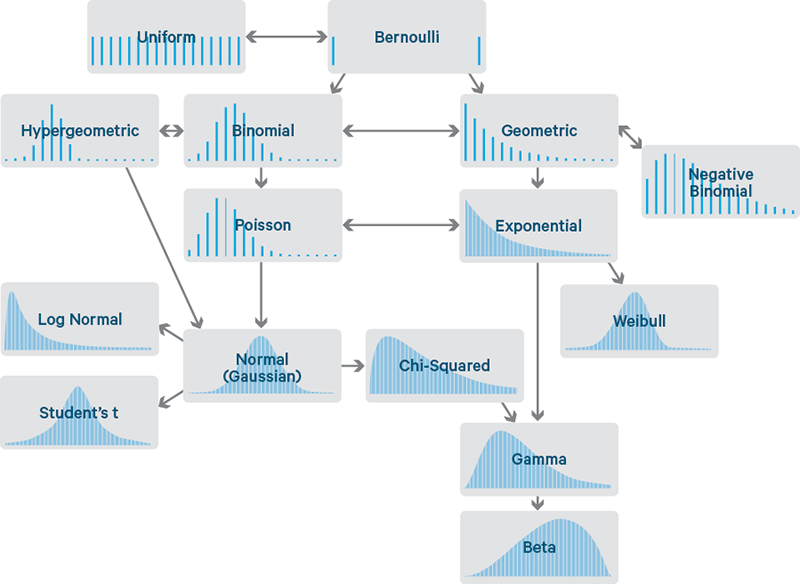
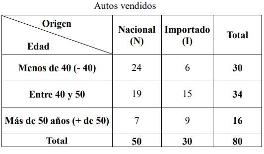
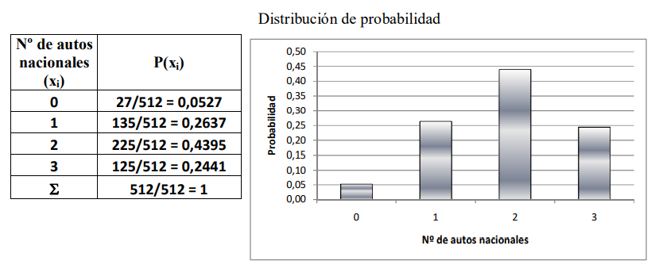
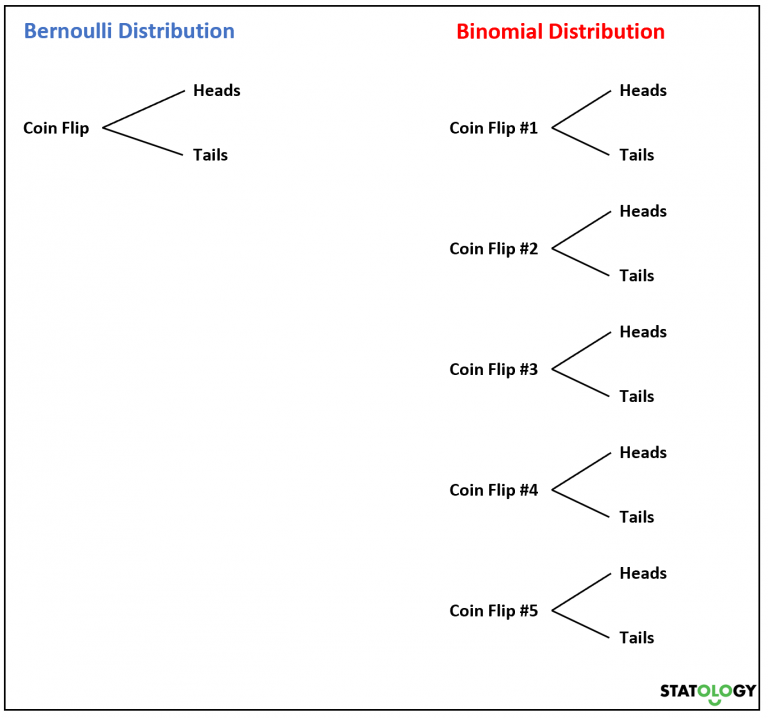
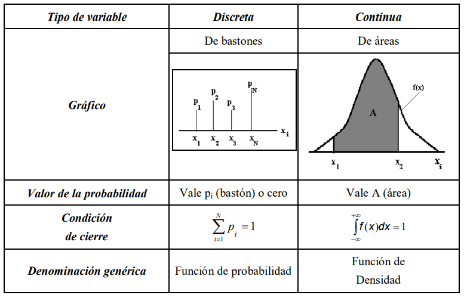

## Distribuciones de probabilidad



Una variable aleatoria es un suceso o evento numérico cuyo valor se determina por medio de un proceso aleatorio. Cuando a todos los posibles valores numéricos de una variable aleatoria se le asignan valores de probabilidad, ya sea mediante un listado o una función matemática el resultado es una distribución de probabilidad. La suma de las probabilidades de todos los resultados numéricos posibles debe ser igual a 1.<br>
En resumen, una distribución de probabilidad es una función que puede asignar valores de probabilidad a cada estado del espacio muestral.
Las variables aleatorias se pueden clasificar en: discretas (surgen de un proceso de conteo) y continuas (surgen de un proceso de medición).
La distribución de probabilidad es de doble eje, constituida por todos los valores de la variable aleatoria (x1, x2,…, xN), a los cuales se asocian con sus correspondientes probabilidades (p1, p2,…, pN). A lo largo de esta distribución y como condición de cierre, la suma de todas las probabilidades debe ser 1.

p1 + p2 +,…,+ pN = 1


### Ejemplo: <br>




Si en la concesionaria se seleccionan tres ventas con reposición y deseamos hacer una distribución de probabilidad del número de autos nacionales, los resultados posibles serían:


Hay ocho resultados posibles. Para obtener la distribución de probabilidad, aplicamos la regla de la adición y de la multiplicación siendo x el número de autos importados. Si las ventas seleccionadas fueran 2, los resultados posibles serían 4.




La Distribución de Probabilidad constituye un sistema completo de sucesos. Es análoga a una distribución de frecuencias relativas, con probabilidad en lugar de frecuencia relativa. De manera que podemos pensar en las distribuciones de probabilidad como formas teóricas o ideales en el límite, de distribuciones de frecuencia relativa cuando el número de observaciones es muy 
grande. Por eso podemos imaginarnos a las distribuciones de probabilidad como si fueran distribuciones de poblaciones, mientras que las distribuciones de frecuencia relativa son distribuciones de muestras de esa población.<br>
Si la variable aleatoria es continua, no pueden listarse todos los posibles valores de la 
variable, motivo por el cual las probabilidades que se determinan por medio de una función matemática son gráficamente representadas por una función de densidad de probabilidad, o curva de probabilidad.

## Características de las Distribuciones de Probabilidad:
Las características generales de las distribuciones de probabilidad difieren según el tipo de variable aleatoria, discreta o continua, que se encuentre bajo estudio. 

Por otro lado existen ciertas normas a la hora de nombrar variables:

#### Si la variable aleatoria es discreta:
1. Puede tomar solamente algunos valores dentro de un intervalo definido.<br>
2. Las probabilidades se representan con los símbolos pi o p(xi).<br>
3. El gráfico de la distribución de probabilidad se denomina gráfico de bastones, por la particular forma que adopta la probabilidad al afectar sólo a determinados puntos del eje de la variable aleatoria xi.<br>
4. Las probabilidades se calculan mediante la aplicación de las reglas provenientes de la teoría clásica de probabilidad como de fórmulas específicas.<br>
5. La condición de cierre se verifica realizando la sumatoria de las probabilidades.<br>
6. La distribución de probabilidad en el caso de una variable aleatoria discreta se denomina genéricamente función de probabilidad.<br>


#### Histograma

```Python
# importando modulos necesarios
%matplotlib inline

import matplotlib.pyplot as plt
import numpy as np 
from scipy import stats 
import seaborn as sns 

np.random.seed(2016) # replicar random

# parametros esteticos de seaborn
sns.set_palette("deep", desat=.6)
sns.set_context(rc={"figure.figsize": (8, 4)})

# Graficando histograma
mu, sigma = 0, 0.2 # media y desvio estandar
datos = np.random.normal(mu, sigma, 1000) #creando muestra de datos

# histograma de distribución normal.
cuenta, cajas, ignorar = plt.hist(datos, 20)
plt.ylabel('frequencia')
plt.xlabel('valores')
plt.title('Histograma')
plt.show()
``` 
#### Distribución Binomial <br>
Se utilizan para variables o eventos del tipo binario (lanzar una moneda) en donde los eventos son igualmente probables. A medida que el espacio muestra crece (lanzar dos veces la moneda vs lanzar 100 veces la moneda), estimar las probabilidades de los eventos se vuelve complejo y es por esto que esta función nos puede ayudar.


p= probabilidad de éxito.<br>
q= Probabilidd de fracaso.<br>
n= espacio muestral.<br>
k= número de éxitos.<br>

```Python
# Construir una función Binomial
from math import factorial

def funcion_binomial(k,n,p):
  num_exitos = factorial(n) #Factorial de la cantidad de casos de éxito buscados.
  num_eventos = factorial (k) * factorial(n-k) #Factorial del espacio muestral.
  exitos_fracaso=pow(p,k) * pow(1-p,(n-k)) # Probabilidad de exitos y fracasos.

  binomial = (num_exitos / num_eventos) * exitos_fracaso #Aplicación de la función binomial.

  return binomial

#Probabilidad de obtener 3 caras en 5 lanzamientos y una probabilidad de éxito del 0.5.
print(funcion_binomial(3,5,0.5))
```
Si bien se utiliza para casos binarios, no quiere decir que la probabilidad de éxito siempre sea del 0.5.<br>

Aquí otro ejemplo:<br>

Una novela ha tenido un gran éxito, y se estima que el 80% de un grupo de lectores ya la han leído.<br>
En un grupo de 4 amigos aficionados a la lectura:<br>
- ¿Cuál es la probabilidad de que en el grupo hayan leído la novela 2 personas?

 ```Python

#Probabilidad de que 2 integrantes del grupo hayan leido la novela con una probabilidad de éxito del 0.8.

print(funcion_binomial(2,4,0.8))
```

```Python
# Graficando Binomial
N, p = 30, 0.4 # parametros de forma 
binomial = stats.binom(N, p) # Distribución
x = np.arange(binomial.ppf(0.01),
              binomial.ppf(0.99))
fmp = binomial.pmf(x) # Función de Masa de Probabilidad
plt.plot(x, fmp, '--') #Esta función recibe un conjunto de valores x e y y los muestra en el plano como puntos unidos por línea.
plt.vlines(x, 0, fmp, colors='b', lw=5, alpha=0.5) #Esta función da formato a las figuras.
plt.title('Distribución Binomial') #Esta función asigna un título.
plt.ylabel('probabilidad') #Esta función etiqueta el eje Y.
plt.xlabel('valores') #Esta función etiqueta el eje X.
plt.show() #Esta función muestra las figuras
```
#### Distribución de Bernoulli<br>
Una variable aleatoria sigue una distribución de Bernoulli si solo tiene dos resultados posibles: 0 o 1. Por ejemplo, supongamos que lanzamos una moneda al aire una vez. Sea p la probabilidad de que caiga cara . Esto significa que la probabilidad de que caiga en cruz es de 1 p. Nuevamente la moneda, que confuso ¿no?.<br>
Ahora, si lanzamos una moneda varias veces, la suma de las variables aleatorias de Bernoulli seguirá una distribución binomial.<br>
Por ejemplo, supongamos que lanzamos una moneda 5 veces y queremos saber la probabilidad de obtener caras k veces. Diríamos que la variable aleatoria X sigue una distribución Binomial. ¿Queda más claro?. Muy bien.



```Python
# Graficando Bernoulli
p =  0.5 # parametro de forma 
bernoulli = stats.bernoulli(p)
x = np.arange(-1, 3)
fmp = bernoulli.pmf(x) # Función de Masa de Probabilidad
fig, ax = plt.subplots()
ax.plot(x, fmp, 'bo')
ax.vlines(x, 0, fmp, colors='b', lw=5, alpha=0.5)
ax.set_yticks([0., 0.2, 0.4, 0.6])
plt.title('Distribución Bernoulli')
plt.ylabel('probabilidad')
plt.xlabel('valores')
plt.show()
```


#### Distribución Poisson<br>
Se utiliza para describir procesos que pueden ser descritos como sucesos raros en donde se considera que la probabilidad del suceso es muy pequeña.
La distribución de Poisson juega un rol importante en complementar la distribución exponencial en la teoría de colas o modelo de líneas de espera.
La varibale aleatoria es el número de veces que ocurre un evento en un intervalo de tiempo, distancia, area, volumen u otra similar. 


Ejemplo:

La probabilidad de que en el lapso de una semana en el taller de la concesionaria uno de los autos vendidos tenga problemas cubiertos por la garantía es 0,02. Suponiendo que en el taller se atienden 450 autos semanalmente. ¿Cuál es la probabilidad de que:<br>
- Se presenten 5 autos con problemas por semana?

```Python
from math import e,factorial

def probabilidad_poisson(lamba_np,x):
     probabilidad = (pow(e,-lamba_np) * pow(lamba_np,x))/factorial(x)
     return probabilidad

print(probabilidad_poisson((450*0.02),5)

```

```Python
# Graficando Poisson
mu =  3.6 # parametro de forma 
poisson = stats.poisson(mu) # Distribución
x = np.arange(poisson.ppf(0.01),
              poisson.ppf(0.99))
fmp = poisson.pmf(x) # Función de Masa de Probabilidad
plt.plot(x, fmp, '--')
plt.vlines(x, 0, fmp, colors='b', lw=5, alpha=0.5)
plt.title('Distribución Poisson')
plt.ylabel('probabilidad')
plt.xlabel('valores')
plt.show()

# histograma
aleatorios = poisson.rvs(1000)  # genera aleatorios
cuenta, cajas, ignorar = plt.hist(aleatorios, 20)
plt.ylabel('frequencia')
plt.xlabel('valores')
plt.title('Histograma Poisson')
plt.show()

```

####  Distribución Hipergeométrica<br>
En la distribución binomial, la probabilidad de éxito es constante en todas las obsevaciones del experimento y el resultado de cualquier observación es independiente de cualquier otro. En un experimento de características hipergeometricas el resultado de una observación es afectado por los resultados de las observaciones previas, por tanto las probabilidades son condicionales.<br>
La Distribución Hipergeométrica se aplica cuando las realizaciones del experimento aleatorio se realizan sin reposición o generan sucesos que son condicionales, lo cual marca la principal diferencia con las distribuciones Binomial y de Poisson


Ejemplo:<br>
Una empresa que importa los autos que vende una concesionaria, desea hacer una encuesta de satisfacción a los compradores de estos autos. De una muestra de 80 autos, 30 son importados. Si se seleccionan 9 clientes. ¿Cuál es la probabilidad de que haya 2 que compraron autos importados?.

```Python
from math import e,factorial

N,X,n,x= 80,30,9,2

Xx = factorial(X)/(factorial(x)*factorial(X-x))
NX_nx= factorial(N-X)/(factorial(n-x)*factorial((N-X)-(n-x)))
Nn = factorial(N)/(factorial(n)*factorial(N-n))

probabilidad_hipergeometrica = (Xx * NX_nx)/Nn

print(probabilidad_hipergeometrica)
```

```Python
# Graficando Hipergeométrica
M, n, N = 30, 10, 12 # parametros de forma 
hipergeometrica = stats.hypergeom(M, n, N) # Distribución
x = np.arange(0, n+1)
fmp = hipergeometrica.pmf(x) # Función de Masa de Probabilidad
plt.plot(x, fmp, '--')
plt.vlines(x, 0, fmp, colors='b', lw=5, alpha=0.5)
plt.title('Distribución Hipergeométrica')
plt.ylabel('probabilidad')
plt.xlabel('valores')
plt.show()
```


#### Si la variable aleatoria es continua:
1. Puede tomar cualquier valor en un determinado campo de variación.<br>
2. La probabilidad se representa con los símbolos fi o f(x).<br>
3. En un punto la probabilidad no tiene sentido. Sólo tiene sentido en un intervalo particular de la variable aleatoria xi, por más pequeño que éste sea.<br>
4. En el gráfico, la distribución de probabilidad se ve como una función continua f(x), y la probabilidad en sí misma, denominada A, se representa como un área entre los puntos x1 y x2.<br>
5. La probabilidad se obtiene calculando la integral, según el criterio de Riemann, de la función f(x), entre los puntos x1 y x2.<br>
6. La condición de cierre se verifica efectuando la integral de la función en todo el campo de variación de la variable aleatoria.<br>
7. La denominación genérica de la distribución de probabilidad en el caso continuo es la de función de densidad debido a que se considera que las probabilidades adquieren densidad, es decir que se "adensan", convirtiéndose en áreas.


#### Distribución Normal<br>
Esta dada por una función de densidad y la probabilidad se obtiene en base a una variable aleatoria xi que se encuentra entre dos valores arbitrarios de x1 y x2, la cual está dada por el área A bajo la curva cuyo valor se encuentra integrando la función f(x) entre ambos valores, es decir que en tanto la probabilidad en un punto cualquiera no tiene sentido.<br>
La solución práctica para obtener esas probabilidades consiste en utilizar la Tabla de Probabilidades apropiada para calcular cualquier probabilidad en el caso normal, sin que importe cuáles son los valores particulares de la variable aleatoria ni los parámetros de la distribución.<br>
La distribución normal requiere al estandarización de las variables mediante la siguiente fórmula:<br>


X = Variable aleatoria.<br>
mu = Media.
sigma = Desvío estándar.

Luego de estandarizar las variables, se debe buscar el valor de Z en la tabla de distribución normal y determinar la probabilidad en base al area delimitada por el experimiento.


```python
# Graficando Normal
mu, sigma = 0, 0.2 # media y desvio estandar
normal = stats.norm(mu, sigma)
x = np.linspace(normal.ppf(0.01),
                normal.ppf(0.99), 100)
fp = normal.pdf(x) # Función de Probabilidad
plt.plot(x, fp)
plt.title('Distribución Normal')
plt.ylabel('probabilidad')
plt.xlabel('valores')
plt.show()
```
#### Distribución Chi cuadrado <br>
A diferencia de la distribución normal, se utiliza para muestras pequeñas, es especifica en cuanto a los grados de libertad y el parámetro de no centralidad. La distribución es positivamente asimétrica, pero la asimetría disminuye al aumentar los grados de libertad. Esta distribución es muy utilizada en Inferencia Estadística para realizar pruebas de hipótesis y la construcción de intervalos de confianza.
Esta distribución se utiliza la n <= 30

```python
# Graficando Chi cuadrado
df = 34 # parametro de forma.
chi2 = stats.chi2(df)
x = np.linspace(chi2.ppf(0.01),
                chi2.ppf(0.99), 100)
fp = chi2.pdf(x) # Función de Probabilidad
plt.plot(x, fp)
plt.title('Distribución Chi cuadrado')
plt.ylabel('probabilidad')
plt.xlabel('valores')
plt.show()
```
#### Distribución T de Student

En las muestras de tamaño mayor a 30, llamadas muestras grandes, las distribuciones de muchos estadísticos son aproximadamente normales, y la aproximación es tanto mejor conforme aumenta el tamaño de la muestra<br>
Para muestras de tamaño menor o igual a 30, llamadas muestras pequeñas, esta aproximación no es buena y va siendo peor a medida que el tamaño de la muestra disminuye.
Es una distribución simétrica, con forma de campana similar a la distribución normal, pero con colas más gruesas. Recordemos que Chi cuadrado carecia de centralidad, si bien también se aplica a muestras pequeñas.<br>
La Distribución t de Student es utilizada para probar si la diferencia entre las medias de dos muestras de observaciones es estadísticamente significativa. Por ejemplo, las alturas de una muestra aleatoria de los jugadores de baloncesto podría compararse con las alturas de una muestra aleatoria de jugadores de fútbol; esta distribución nos podría ayudar a determinar si un grupo es significativamente más alto que el otro.

```python
# Graficando t de Student
df = 50 # parametro de forma.
t = stats.t(df)
x = np.linspace(t.ppf(0.01),
                t.ppf(0.99), 100)
fp = t.pdf(x) # Función de Probabilidad
plt.plot(x, fp)
plt.title('Distribución t de Student')
plt.ylabel('probabilidad')
plt.xlabel('valores')
plt.show()
```





## Homework <br>
Distribución Binomial:<br>
1. La probabilidad de que a un estudiante le guste este modulo es de 0.7 (en Henry somos optimistas), cual es la probabilidad de que les guste este módulo a 6 de los 10 estudiantes.<br>
2. De todos los push a Git en un Henry Challenge, el 90% lo envía a término. Si se envían 9 ¿cuál es la probabilidad de que 7 lleguen a término?.<br>
3. En relación con el enunciado anterior cálcule la probabilidad de que 7 o más lleguen a término.<br>
Distribución de Poisson:<br>
4. La cantidad de alumnos promedio que se ausentan en un día de clases en la carrera de Data Science es de 10. Calcular cual es la probabilidad de que se ausenten 7 alumnos.<br>
5. Cuando inicia una clase, los estudiantes ingresan a un ritmo de 5 estudiantes por minuto. Calcular cual es la probabilidad de que ingresen 7 estudiantes por minuto.<br>
6. Cada 3 días ingresan 10 estudiantes nuevos al Prep Course de Henry, calcule la probabilidad de que ingresen 15 nuevos estudiantes en un período de 6 días.<br>
7. En una distribución de Poisson de lamba_np=3, cual es la probabilidad de x>=1.<br>
Distribución Normal:<br>
8. La calificación promedio de los estudiantes de Henry es de 78 con una desviación estandar de 25. Cual es la probabilidad de tener estudiantes con calificaciones mayores o iguales 90.

Tablas de Distribución [tablas](https://github.com/soyHenry/DS-M2/blob/3aae1f7b63bf723a96a8094a2e1598e69bb10b34/Clase%2006/Tablas%20Distribuci%C3%B3n.pdf)

<table class="hide" width="100%" style='table-layout:fixed;'>
  <tr>
    <td>
      <a href="https://airtable.com/shrSzEYT4idEFGB8d?prefill_clase=00-PrimerosPasos">
        
        <br>
        Hacé click acá para dejar tu feedback sobre esta clase.
      </a>
    </td>
  </tr>
</table>
