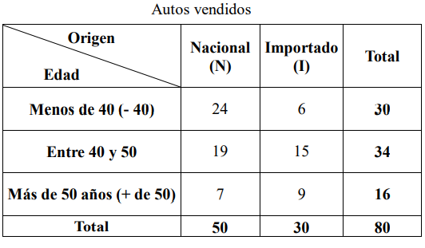
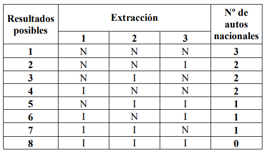
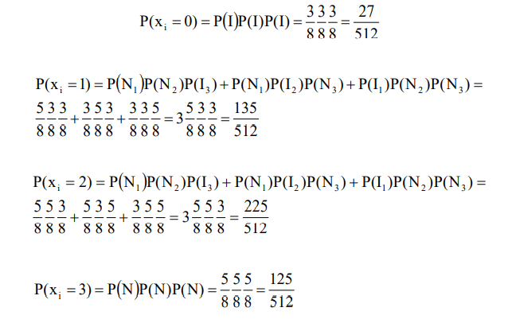
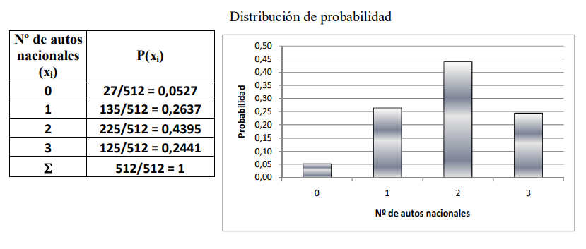
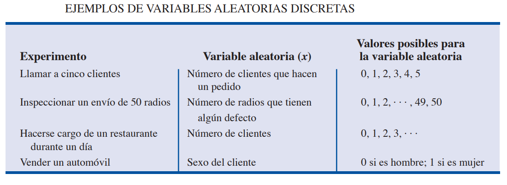
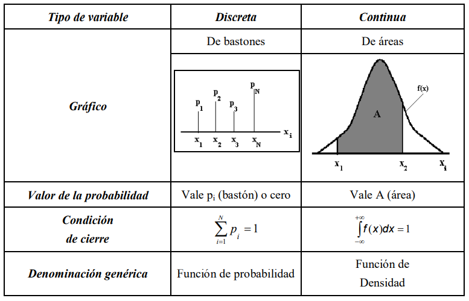

## Distribuciones de probabilidad


Una variable aleatoria es un suceso o evento numérico cuyo valor se determina por medio de un proceso aleatorio. Cuando a todos los posibles valores numéricos de una variable aleatoria se le asignan valores de probabilidad, ya sea mediante un listado o una función matemática el resultado es una distribución de probabilidad. La suma de las probabilidades de todos los resultados numéricos posibles debe ser igual a 1.<br>
Las variables aleatorias se pueden clasificar en: discretas (surgen de un proceso de conteo) y continuas (surgen de un proceso de medición).
La distribución de probabilidad es de doble eje, constituida por todos los valores de la variable aleatoria (x1, x2,…, xN), a los cuales se asocians con sus correspondientes probabilidades (p1, p2,…, pN). A lo largo de esta distribución y como condición de cierre, la suma de todas las probabilidades debe ser 1.

p1 + p2 +,…,+ pN = 1

![autos](../_src/assets/distributionprob

### Ejemplo: <br>




Si en la concesionaria se seleccionan tres ventas con reposición y deseamos hacer una distribución de probabilidad del número de autos nacionales, los resultados posibles serían:



Hay ocho resultados posibles. Para obtener la distribución de probabilidad, aplicamos la regla de la adición y de la multiplicación siendo x el número de autos importados. Si las ventas seleccionadas fueran 2, los resultados posibles serían 4.






La Distribución de Probabilidad constituye un sistema completo de sucesos. Es análoga a una distribución de frecuencias relativas, con probabilidad en lugar de frecuencia relativa. De manera que podemos pensar en las distribuciones de probabilidad como formas teóricas o ideales en el límite, de distribuciones de frecuencia relativa cuando el número de observaciones es muy 
grande. Por eso podemos imaginarnos a las distribuciones de probabilidad como si fueran distribuciones de poblaciones, mientras que las distribuciones de frecuencia relativa son distribuciones de muestras de esa población.<br>
Si la variable aleatoria es continua, no pueden listarse todos los posibles valores de la 
variable, motivo por el cual las probabilidades que se determinan por medio de una función matemática son gráficamente representadas por una función de densidad de probabilidad, o curva de probabilidad.

## Características de las Distribuciones de Probabilidad:
Las características generales de las distribuciones de probabilidad difieren según el tipo de variable aleatoria, discreta o continua, que se encuentre bajo estudio. 

Por otro lado existen ciertas normas a la hora de nombrar variables:

#### Si la variable aleatoria es discreta:
1. Puede tomar solamente algunos valores dentro de un intervalo definido.<br>
2. Las probabilidades se representan con los símbolos pi o p(xi).<br>
3. El gráfico de la distribución de probabilidad se denomina gráfico de bastones, por la particular forma que adopta la probabilidad al afectar sólo a determinados puntos del eje de la variable aleatoria xi.<br>
4. Las probabilidades se calculan mediante la aplicación de las reglas provenientes de la teoría clásica de probabilidad como de fórmulas específicas.<br>
5. La condición de cierre se verifica realizando la sumatoria de las probabilidades.<br>
6. La distribución de probabilidad en el caso de una variable aleatoria discreta se denomina genéricamente función de probabilidad.<br>



#### Histograma

```Python
# importando modulos necesarios
%matplotlib inline

import matplotlib.pyplot as plt
import numpy as np 
from scipy import stats 
import seaborn as sns 

np.random.seed(2016) # replicar random

# parametros esteticos de seaborn
sns.set_palette("deep", desat=.6)
sns.set_context(rc={"figure.figsize": (8, 4)})

# Graficando histograma
mu, sigma = 0, 0.2 # media y desvio estandar
datos = np.random.normal(mu, sigma, 1000) #creando muestra de datos

# histograma de distribución normal.
cuenta, cajas, ignorar = plt.hist(datos, 20)
plt.ylabel('frequencia')
plt.xlabel('valores')
plt.title('Histograma')
plt.show()
``` 

#### Distribución Poisson
```Python
# Graficando Poisson
mu =  3.6 # parametro de forma 
poisson = stats.poisson(mu) # Distribución
x = np.arange(poisson.ppf(0.01),
              poisson.ppf(0.99))
fmp = poisson.pmf(x) # Función de Masa de Probabilidad
plt.plot(x, fmp, '--')
plt.vlines(x, 0, fmp, colors='b', lw=5, alpha=0.5)
plt.title('Distribución Poisson')
plt.ylabel('probabilidad')
plt.xlabel('valores')
plt.show()

# histograma
aleatorios = poisson.rvs(1000)  # genera aleatorios
cuenta, cajas, ignorar = plt.hist(aleatorios, 20)
plt.ylabel('frequencia')
plt.xlabel('valores')
plt.title('Histograma Poisson')
plt.show()

```
#### Distribución Poisson

```Python
# Graficando Binomial
N, p = 30, 0.4 # parametros de forma 
binomial = stats.binom(N, p) # Distribución
x = np.arange(binomial.ppf(0.01),
              binomial.ppf(0.99))
fmp = binomial.pmf(x) # Función de Masa de Probabilidad
plt.plot(x, fmp, '--')
plt.vlines(x, 0, fmp, colors='b', lw=5, alpha=0.5)
plt.title('Distribución Binomial')
plt.ylabel('probabilidad')
plt.xlabel('valores')
plt.show()
```

####  Distribución Geométrica
```Python
# Graficando Geométrica
p =  0.3 # parametro de forma 
geometrica = stats.geom(p) # Distribución
x = np.arange(geometrica.ppf(0.01),
              geometrica.ppf(0.99))
fmp = geometrica.pmf(x) # Función de Masa de Probabilidad
plt.plot(x, fmp, '--')
plt.vlines(x, 0, fmp, colors='b', lw=5, alpha=0.5)
plt.title('Distribución Geométrica')
plt.ylabel('probabilidad')
plt.xlabel('valores')
plt.show()
```

#### Distribución de Bernoulli

```Python
# Graficando Bernoulli
p =  0.5 # parametro de forma 
bernoulli = stats.bernoulli(p)
x = np.arange(-1, 3)
fmp = bernoulli.pmf(x) # Función de Masa de Probabilidad
fig, ax = plt.subplots()
ax.plot(x, fmp, 'bo')
ax.vlines(x, 0, fmp, colors='b', lw=5, alpha=0.5)
ax.set_yticks([0., 0.2, 0.4, 0.6])
plt.title('Distribución Bernoulli')
plt.ylabel('probabilidad')
plt.xlabel('valores')
plt.show()
```

#### Si la variable aleatoria es continua:
1. Puede tomar cualquier valor en un determinado campo de variación.<br>
2. La probabilidad se representa con los símbolos fi o f(x).<br>
3. En un punto la probabilidad no tiene sentido. Sólo tiene sentido en un intervalo particular de la variable aleatoria xi, por más pequeño que éste sea.<br>
4. En el gráfico, la distribución de probabilidad se ve como una función continua f(x), y la probabilidad en sí misma, denominada A, se representa como un área entre los puntos x1 y x2.<br>
5. La probabilidad se obtiene calculando la integral, según el criterio de Riemann, de la función f(x), entre los puntos x1 y x2.<br>
6. La condición de cierre se verifica efectuando la integral de la función en todo el campo de variación de la variable aleatoria.<br>
7. La denominación genérica de la distribución de probabilidad en el caso continuo es la de función de densidad debido a que se considera que las probabilidades adquieren densidad, es decir que se "adensan", convirtiéndose en áreas.


#### Distribución Normal
```python
# Graficando Normal
mu, sigma = 0, 0.2 # media y desvio estandar
normal = stats.norm(mu, sigma)
x = np.linspace(normal.ppf(0.01),
                normal.ppf(0.99), 100)
fp = normal.pdf(x) # Función de Probabilidad
plt.plot(x, fp)
plt.title('Distribución Normal')
plt.ylabel('probabilidad')
plt.xlabel('valores')
plt.show()
```
#### Distribución Chi cuadrado
```python
# Graficando Chi cuadrado
df = 34 # parametro de forma.
chi2 = stats.chi2(df)
x = np.linspace(chi2.ppf(0.01),
                chi2.ppf(0.99), 100)
fp = chi2.pdf(x) # Función de Probabilidad
plt.plot(x, fp)
plt.title('Distribución Chi cuadrado')
plt.ylabel('probabilidad')
plt.xlabel('valores')
plt.show()
```
#### Distribución T de Student

```python
# Graficando t de Student
df = 50 # parametro de forma.
t = stats.t(df)
x = np.linspace(t.ppf(0.01),
                t.ppf(0.99), 100)
fp = t.pdf(x) # Función de Probabilidad
plt.plot(x, fp)
plt.title('Distribución t de Student')
plt.ylabel('probabilidad')
plt.xlabel('valores')
plt.show()
```

#### Distribución de Log-normal
```python

# Graficando Log-Normal
sigma = 0.6 # parametro
lognormal = stats.lognorm(sigma)
x = np.linspace(lognormal.ppf(0.01),
                lognormal.ppf(0.99), 100)
fp = lognormal.pdf(x) # Función de Probabilidad
plt.plot(x, fp)
plt.title('Distribución Log-normal')
plt.ylabel('probabilidad')
plt.xlabel('valores')
plt.show()
```

#### Distribución de Exponencial

```python
# Graficando Exponencial
exponencial = stats.expon()
x = np.linspace(exponencial.ppf(0.01),
                exponencial.ppf(0.99), 100)
fp = exponencial.pdf(x) # Función de Probabilidad
plt.plot(x, fp)
plt.title('Distribución Exponencial')
plt.ylabel('probabilidad')
plt.xlabel('valores')
plt.show()
```





## Homework

1. Las notas de un Chekpoint pueden variar entre 1 y 10, tomando valores decimales. Idique que tipo de variable es.<br>


Completa la tarea descrita en el archivo [README](https://github.com/soyHenry/Python-Prep/blob/4aec1885136fdcff98899d2be13c8908b39f8b21/02%20-%20Variables%20y%20Tipos%20de%20Datos/Prep_Course_Homework_02.md)

<table class="hide" width="100%" style='table-layout:fixed;'>
  <tr>
    <td>
      <a href="https://airtable.com/shrSzEYT4idEFGB8d?prefill_clase=00-PrimerosPasos">
        
        <br>
        Hacé click acá para dejar tu feedback sobre esta clase.
      </a>
    </td>
  </tr>
</table>
