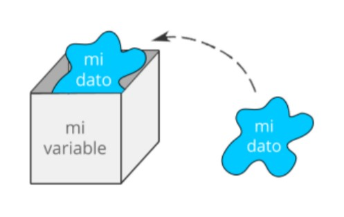

## CLASE 2

## Variables

Una variable es un espacio de memoria donde guardamos un dato, ese espacio de memoria a la vez recibe un nombre y esto conforma la estructura de datos más simple que podemos encontrar.



Por otro lado existen ciertas normas a la hora de nombrar variables:

* El nombre no puede empezar con un número<br>
  Por ejemplo "mi_variable" sería correcto, pero "123mi_variable" sería erróneo 
* No se permite el uso de guiones del medio -<br>
  Por ejemplo "mi-variable" sería erróneo
* No se permite el uso de espacios.<br>
  Por ejemplo "mi variable" sería erróneo
* No usar nombres reservados para Python. Las palabras reservadas son utilizadas por Python internamente, por lo que no podemos usarlas para nuestras variables o funciones.<br>
  Por ejemplo, a veces podríamos usar "int" ó "for" y esto nos daría error, porque como se verá más adelante, esas palabras son parte de la sintaxis de Python.

### Constantes

Sin embargo, cuando ese dato no lo alojamos en una variable y lo utilizamos directamente, recibe el nombre de constante.

### Tipos de Datos

Es importante notar, que podemos encontrarnos con datos de tipos distintos, es decir numéricos, alfanuméricos o booleanos.

En Python tenemos los siguientes:
 * Enteros: el conjunto de números enteros
 * Floats: el conjunto de números reales o de punto flotante
 * Cadenas o Strings: es texto, caracteres alfanuméricos que se introducen entre comillas dobles o simples
 * Booleanos: representan Verdadero ó Falso
 * Complejos: el conjunto de números complejos

Todo valor que pueda ser asignado a una variable tiene asociado un tipo de dato y esto establece qué operaciones se pueden realizar sobre la misma.

<hr width="75%">
  <p align="center">
  Tip: En Python hay algunas funcionalidades ya presentes por defecto, como por ejemplo la funcion **print()** que permite mostrar una salida por pantalla y la función range() que devuelve un rango numérico según los parámetros que recibe y con la función **type()** es posible ver el tipo de dato de una variable
  </p>
<hr width="75%">

### Operaciones entre Variables

Con diferentes tipos de datos podemos hacer diferentes tipos de operaciones. Y hay operaciones no permitidas entre variables de diferentes tipos de datos.

**Operaciones aritméticas:**

| Operación | Operador | Ejemplo |
| :---      |  :----:  |    ---: |
| Suma      | + | 3 + 5.5 = 8.5 |
| Resta   | -  | 4 - 1 = 3  |
| Multiplicación | *  | 4 * 2 = 8  |
| Potenciación | 4<sup>2</sup>  | 4**2 = 16  |
| División (Cociente) | /  | 4 / 2 = 2  |
| División (parte entera) | //  | 14 // 3 = 4  |
| División (resto) | %  | 14 % 3 =  2 |

**Operadores relacionales:**

| Operación | Operador | Ejemplo |
| :---      |  :----:  |    ---: |
| == | Igual | 10 == 3 = False |
| != | Distinto | 10 != 3 = True |
| >	| Mayor	| 10 > 3 = True |
| < | Menor	| 10 < 3 = False |
| >= | Mayor o igual | 10 >= 3 = True |
| <= | Menor o igual | 10 <= 3 = False |

**Operaciones de asignación:**

| Operación | Operador | Ejemplo |
| :---      |  :----:  |    ---: |
| =   | x=7  | x=7  |
| +=  | x+=2  | x=x+2 = 9  |
| -=  | x-=2  | x=x-2 = 5  |
| *=  | x*=2  | x=x*2 = 14  |
| /=  | x/=2  | x=x/2 = 3.5  |
| %=  | x%=2  | x=x%2 = 1  |
| //=  | x//=2  | x=x//2 = 3  |
| **=  | x**=2  | x=x**2 = 49  |
| &=  | x&=2  | x=x&2 = 2  |
| ^=  | x^=2  | x=x^2 = 5  |
| >>=  | x>>=2  | x=x>>2 = 1  |
| <<= | x<<=2 | x=x<<=2 = 28  |


Operación: |=   <br>
Operador: x|=2  <br>
Ejemplo: x=x|2 = 7  <br>

Cuando tratamos con texto, podemos hacer otras operaciones:

| Operación | Operador | Ejemplo |
| :---      |  :----:  |    ---: |
| Concatenar | + | 'hola ' + 'mundo !' = 'hola mundo!' |
| Multiplicar | * | 'ja ' * 3 = 'ja ja ja' |

Algunos ejemplos en Python:

```python
>>> a = 'Hola '
>>> b = 'Mundo !'
>>> print(a + b)
Hola Mundo !

>>> x = 3
>>> y = 12
>>> print(x + y)
15

>>> print(a + x)
---------------------------------------------------------------------------
TypeError                                 Traceback (most recent call last)
~\AppData\Local\Temp/ipykernel_18232/136165486.py in <module>
----> 1 print(a + x)

TypeError: can only concatenate str (not "int") to str
```

Notar que en las operaciones que no están permitidas arroja un error, que es muy descriptivo. En este caso no es posible sumar un valor entero con un valor alfanumérico.

```python
>>> # Dividir "y" entre "x"
>>> y = 9
>>> x = 3
>>> print(y/x)
3.0

>>> # Potencia de "y" elevado a la "x"
>>> y = 2
>>> x = 4
>>> print(y**x)
16

>>> # Devolver el resto de la división
>>> y = 13
>>> x = 3
>>> print(y%x)
1

>>> # Imprimir el tipo de dato de una variable y una constante
>>> y = 2.5
>>> type(y)
float
>>> type(2.5)
float
```

Notar que anteponiendo el carácter numeral (#) es posible agregar comentarios en el código. Por otra parte, la función **type()** es muy útil para saber a qué tipo de dato corresponde un elemento.

**Operaciones Lógicas**

Son operaciones en las que entran en uso el tipo de datos booleano, es decir, que nos permiten representar valores verdadero o falso. Para verlo mejor, es necesario recurrir a lo que llamamos tablas de verdad.
Veremos muy comúnmente representar verdadero con un "1" y falso con un "0".

Tabla del operador lógico "and", se verifican que A y B sean verdaderas.  
| A | B | A and B |
| :- | :--: | -: |
| 1 | 0 | 0 |
| 0 | 0 | 0 |
| 0 | 1 | 0 |
| 1 | 1 | 1 |

Tabla del operador lógico "or", se verifican que A o B sean verdaderas. 
| A | B | A or B |
| :- | :--: | -: |
| 1 | 0 | 1 |
| 0 | 0 | 0 |
| 0 | 1 | 1 |
| 1 | 1 | 1 |

Tambien es posible representar la negación, con el operador not()

Tabla del operador lógico "Or Exclusiva", se verifica ((A and not(B)) or (not(A) and B))
| A | B | A "or exclusiva" B |
| :- | :--: | -: |
| 1 | 0 | 1 |
| 0 | 0 | 0 |
| 0 | 1 | 1 |
| 1 | 1 | 0 |

```python
>>> a = True
>>> b = False
>>> print(a or b)
True
```

<hr width="75%">
  <p align="center">
  Tips: Notar que las constantes "True" y "False" se escriben con la primer letra mayúscula y el resto minúsculas, de otra forma arrojaría un error
  </p>
<hr width="75%">

### Conversión de tipos de datos

Puede haber ocasiones en las que desee especificar un tipo en una variable. Esto se puede hacer con lo que se denomina **casting**. 
La conversión de tipo de dato en python se realiza mediante funciones:

int(): construye un número entero a partir de un literal entero, un literal flotante (eliminando todos los decimales) o un literal de cadena (siempre que la cadena represente un número entero)
float(): construye un número flotante a partir de un literal entero, un literal flotante o un literal de cadena (siempre que la cadena represente un flotante o un entero)
str(): construye una cadena a partir de una amplia variedad de tipos de datos, incluidas cadenas, literales enteros y literales flotantes

```python
>>> x = '2'
>>> print(type(x))
<class 'str'>
>>> x = int(x)
>>> print(type(x))
<class 'int'>
>>> y = int(2.8)
>>> print(y)
2
```

## CLASE 3

## Flujos de Control

### Condicionales

Los condicionales son bloques de código que se ejecutan únicamente si se cumple una condición. 
El resultado de esta condición debe ser booleano (True o False).
Esto se logra mediante la sentencia **if**.
Con la sentencia **elif** se puede agregar un número arbitrario de condiciones. 
Por otra parte, se puede ejecutar código si la/s condición/es no se cumple/n con la sentencia **else**.


```python
>>> valor = 0
>>> if (valor < 0):
>>>     print('El número es negativo')
>>> elif (valor > 0):
>>>     print('El número es positivo')
>>> else:
>>>     print('El número es igual a cero')
El número es igual a cero
```

### Ciclos Iterativos o Loops

Son bloques de código que se repiten una cierta cantidad de veces en función de ciertas condiciones.

Un ciclo **for** repite un bloque de código tantas veces como elementos haya dentro del rango entre 1 y 10:

```python
>>> for n in range(1,10):
>>>     print(n)
1
2
3
4
5
6
7
8
9
```

Un ciclo **while** repite un bloque de código mientras que cierta condición se cumpla:

```python
>>> n = 1
>>> while (n < 10):
>>>     print(n)
>>>     n = n + 1
1
2
3
4
5
6
7
8
9
```

<hr width="75%">
  <p align="center">
  Hemos llegado hasta este punto y se repasaron algunos de los conceptos más fundamentales de la programación y de Python, pero es necesario detenerse en algunos detalles, que tienen que ver precisamente con el lenguaje que estamos utilizando:

  * En Python es importante la indentación, notar que el código que se ejecuta dentro de una sentencia if, for o while está indentado.
  * También es importante notar los ":"
  * En Python, cada vez que hagamos referencia a un rango, por ejemplo "1,10" el primer número se incluye y el último no.
  </p>
<hr width="75%">

### Sentencia Break

La sentencia break permite alterar el comportamiento de los bucles while y for. Concretamente, permite terminar con la ejecución del bucle. Esto significa que una vez se encuentra la palabra break, el bucle se habrá terminado.
Veamos cómo podemos usar el break con bucles for. El range(5) generaría 5 iteraciones, donde la i valdría de 0 a 4. Sin embargo, en la primera iteración, terminamos el bucle prematuramente.
El break hace que nada más empezar el bucle, se rompa y se salga sin haber hecho nada.

```python
>>> for i in range(5):
>>>   print(i)
>>>   break
0
```

Un ejemplo un poco más útil, sería el de buscar una letra en una palabra. Se itera toda la palabra y en el momento en el que se encuentra la letra que buscábamos, se rompe el bucle y se sale. Esto es algo muy útil porque si ya encontramos lo que estábamos buscando, no tendría mucho sentido seguir iterando la lista, ya que desperdiciaríamos recursos.

```python
>>> cadena = 'Python'
>>> for letra in cadena:
>>>     if letra == 'h':
>>>         print("Se encontró la h")
>>>         break
>>>     print(letra)
P
y
t
Se encontró la h
```

El break también nos permite alterar el comportamiento del while. En el ejemplo, la condición while True haría que la sección de código se ejecutará indefinidamente, pero al hacer uso del break, el bucle se romperá cuando x valga cero.

```python
>>> x = 5
>>> while True:
>>>     x -= 1
>>>     print(x)
>>>     if x == 0:
>>>         break
>>> print("Fin del bucle")
4
3
2
1
0
Fin del bucle
```

Por norma general, y salvo casos muy concretos, si ves un while True, es probable que haya un break dentro del bucle.

### Sentencia Continue

El uso de continue al igual que el ya visto break, permite modificar el comportamiento de de los bucles while y for.
Concretamente, la sentencia continue se salta todo el código restante en la iteración actual y vuelve al principio en el caso de que aún queden iteraciones por completar.
La diferencia con la sentencia break es que el continue no rompe el bucle, si no que pasa a la siguiente iteración saltando el código pendiente.
En el siguiente ejemplo vemos como al encontrar la letra P se llama al continue, lo que hace que se salte el print(). Es por ello por lo que no vemos la letra P impresa en pantalla.

```python
>>> cadena = 'Python'
>>> for letra in cadena:
>>>     if letra == 'P':
>>>         continue
>>>     print(letra)
y
t
h
o
n
```

## Clase 04

## Estructuras de datos

Anteriormente se mencionó que un dato representa la realidad, y se presentó el concepto de variable, que es un elemento que nos permite guardar un dato dentro de nuestro programa. Sin embargo, rápidamente vamos a llegar a la conclusión de que una variable puede llegar a quedar insuficiente para ciertas representaciones. Ante esta situación, en los lenguajes de programación tenemos estructuras de datos más complejas, en el caso de Python contamos con listas, tuplas y diccionarios.

### Lista

Una estructura de datos muy importante en Python es la lista, que consiste en una serie de elementos ordenados.
Esos elementos pueden ser de distinto tipo, e incluso pueden ser de tipo lista también.<br>

Operaciones con listas:
* Creacion 
```python
mi_lista = ['Rojo','Azul','Amarillo','Naranja','Violeta','Verde']
```
* Imprimir
```python
print(mi_lista)
```
* Ver el tipo de dato 
```python
type(mi_lista)
```

Las listas, así como otras estructuras de datos que se verán en adelante, tienen varios elementos, motivo por el cual cuando se quiere acceder en específico se requiere de un **índice** que va a hacer referencia al elemento dentro de la lista:

* Imprimir el tercer elemento de la lista (el índice comienza en cero)
```python
print(mi_lista[2])
```
* Acceder a un rango dentro de la lista (el límite inferior se incluye y el superior se excluye)
```python
print(mi_lista[0:2])
```
* Al no poner primer valor, Python asume que es un 0
```python
>>> print(mi_lista[:2])
['Rojo', 'Azul']
```
* Al no poner segundo valor, Python asume que se trata de todos los elementos a partir del primero 
```python
 >>> print(mi_lista[0:])
 ['Rojo', 'Azul', 'Amarillo', 'Naranja', 'Violeta', 'Verde']
 ```
* Agregar un elemento al final de la lista (Si el elemento ya existe va a quedar duplicado)
```python
mi_lista.append('Blanco') 
```
* Agregar un elemento especificando el índice 
```python
 >>> mi_lista.insert(3,'Negro')
 >>> print(mi_lista[:])
['Rojo', 'Azul', 'Amarillo', 'Negro', 'Naranja', 'Violeta', 'Verde']
```
* Concatenar una nueva lista a la lista previamente creada 
```python
mi_lista.extend(['Marrón','Gris'])
```
* Encontrar el índice de un valor específico 
```python
>>> print(mi_lista.index('Azul'))
1
```
* Eliminar un elemento de la lista (Si el elemento no existe va a arrojar un error)
```python 
>>> mi_lista.remove('Blanco') 
---------------------------------------------------------------------------
ValueError                                Traceback (most recent call last)
~\AppData\Local\Temp/ipykernel_10044/308548076.py in <module>
----> 1 mi_lista.remove('Blanco')

ValueError: list.remove(x): x not in list
>>> mi_lista.remove('Negro') 
```
* Extraer y recuperar el último elemento de la lista 
```python 
>>> ultimo = mi_lista.pop()
>>> print(ultimo)
Gris
```
* Multiplicar la lista 3 veces 
```python 
>>> print(['a','b','c'] * 3)
['a', 'b', 'c', 'a', 'b', 'c', 'a', 'b', 'c']
```
* Ordenar una lista de menor a mayor
```python 
>>> lista= [1,4,3,6,8,2]
>>> lista.sort()
>>> print(lista)
[1,2,3,4,6,8]
```
* Ordenar una lista de mayor a menor
```python 
>>> lista= [1,4,3,6,8,2]
>>> lista.sort(reverse=True)
>>> print(lista)
[8,6,4,3,2,1]
```

### Tupla

Son una estructura similar a las listas, la diferencia está en que no se pueden modificar una vez creadas, es decir que son **inmutables**:

* Convertir una lista a tupla 
```python 
mi_tupla=tuple(mi_lista)
```
* Imprimir el índice 1 de la tupla 
```python 
>>> print(mi_tupla[1])
Azul
```
* Evaluar si un elemento está contenido en la tupla (Devuelve un valor booleano)
```python
>>> 'Rojo' in mi_tupla
True
```
* Evaluar las veces que está un elemento específico 
```python
>>> mi_tupla.count('Rojo')
1
```
* Tupla con un solo elemento 
```python
mi_tupla_unitaria = ('Blanco',)
```
* Empaquetado de tupla, tupla sin paréntesis 
```python
mi_tupla='Gaspar', 5, 8, 1999
```
* Desempaquetado de tupla, se guardan los valores en orden de las variables 
```python
>>> nombre, dia, mes, año = mi_tupla
>>> print("Nombre: ", nombre, " - Dia:", dia, " - Mes: ", mes, " - Año: ", año)
Nombre:  Gaspar  - Dia: 5  - Mes:  8  - Año:  1999
```
* Convertir una tupla en una lista 
```python
mi_lista=list(mi_tupla)
```

### Diccionario

Un diccionario tiene una organización de 'clave' y 'valor':

* Crear un diccionario 
```python
mi_diccionario = {  'Colores Primarios': ['Rojo','Azul','Amarillo'], 
                    'Colores secundarios': ['Naranja','Violeta','Verde'], 
                    'Clave3': 10,
                    'Clave4': False}
```
* Imprimir un valor a través de su clave 
```python
>>> print(mi_diccionario['Colores secundarios'])
['Naranja', 'Violeta', 'Verde']
```
* Agregar un valor 
```python
mi_diccionario['Clave5']='Otro ejemplo'
```
* Cambiar un valor 
```python
mi_diccionario['Clave3']=2
```
* Eliminar un elemento de un diccionario a través de su clave 
```python
del mi_diccionario['Clave4']
```
* Utilizar una tupla como clave de un diccionario 
```python
mi_tupla=("Argentina", "Italia", "Inglaterra")
mi_diccionario={mi_tupla[0]:"Buenos Aires", 
                mi_tupla[1]:"Roma", 
                mi_tupla[2]:"Londres"}
```
* Colocar una tupla dentro de un diccionario 
```python
mi_diccionario={'Clave1':'Valor1', 'Clave2':(1,2,3,4,5)}
```
* Colocar una lista dentro de un diccionario (Notar que la diferencia está en el paréntesis '()' y el corchete '[]')
```python
 mi_diccionario={'Clave1':'Valor1', 'Clave2':[1,2,3,4,5]} 
 ```
* Colocar un diccionario dentro de un diccionario 
```python
mi_diccionario={'Clave1':'Valor1', 'Clave2':{'numeros':[1,2,3,4,5]}}
```
* Imprimir las claves del diccionario 
```python
 >>> print(mi_diccionario.keys())
 dict_keys(['Clave1', 'Clave2'])
 ```
* Imprimir los valores del diccionario 
```python
 >>> print(mi_diccionario.values())
 dict_values(['Valor1', {'numeros': [1, 2, 3, 4, 5]}])
 ```
* Imprimir la longitud del diccionario 
```python
 >>> len(mi_diccionario)
 2
 ```
<hr width="75%">
  <p align="center">
  Tips: La funcionalidad **del** permite eliminar cualquier estructura de datos y la funcionalidad **len** permite obtener el tamaño de la estructura de datos
  </p>
<hr width="75%">

## CLASE 5

## Iteradores e Iterables

Permiten iterar colecciones de datos que sean iterables. Si tenemos una determinada colección de datos, en este caso una lista con varios valores, y queremos mostrar sus valores uno a uno por pantalla podría resolverse de la siguiente manera con un while.

```python
>>> lista = [5, 4, 9, 2]
>>> i = 0
>>> while i < len(lista):
>>>     elemento = lista[i]
>>>     print(elemento)
>>>     i += 1
5
4
9
2
```

Aunque es una forma válida, en Python existe una forma mucho más fácil de iterar una lista. Dicha forma es la siguiente.

```python
>>> lista = [5, 4, 9, 2]
>>> for elemento in lista:
>>>     print(elemento)
5
4
9
2
```

### Iterables

Una clase iterable es una clase que puede ser iterada. Dentro de Python hay gran cantidad de clases iterables como las listas, strings, diccionarios o archivos. Si tenemos una clase iterable, podemos usarla a la derecha del for de la siguiente manera.

```python
for elemento in [clase_iterable]:
```

En el ciclo for, como se puede ver, la variable elemento irá tomando los valores de cada elemento presente en la clase iterable. De esta manera, ya no tenemos que ir accediendo manualmente con [] a cada elemento.
Anteriormente hemos visto un ejemplo iterando una lista, pero también podemos iterar una cadena, ya que es una clase iterable. Al iterar una cadena se nos devuelve cada letra presente en la misma. La sintaxis se asemeja bastante al lenguaje natural, sería algo así como decir “poner en c cada elemento presente en la cadena”.

```python
>>> cadena = "Hola"
>>> for c in cadena:
>>>     print(c)
H
o
l
a
```

Además de obtener el elemento dentro del iterable, también es posible obtener el índice en el que está posicionado utilizando la función **enumerate**

```python
>>> cadena = "Hola"
>>> for i, c in enumerate(cadena):
>>>   print(i, c)
0 H
1 o
2 l
3 a
```

Para saber si una clase es iterable o no hay dos opciones. La primera sería consultar la documentación oficial de Python. La segunda es ver si la clase u objeto en cuestión hereda de Iterable. Con isinstance() podemos comprobar si una clase hereda de otra.

```python
>>> from collections import Iterable
>>> cadena = "Hola"
>>> numero = 3
>>> print("cadena", isinstance(cadena, Iterable))
>>> print("numero", isinstance(numero, Iterable))
cadena True
numero False
```

Python nos ofrece también diferentes métodos que pueden ser usados sobre clases iterables como los que se muestran a continuación:

* list() convierte a lista una clase iterable
* sum() para sumar
* join() permite unir cada elemento de una clase iterable con el primer argumento usado.

```python
>>> print(list("Hola"))
['H', 'o', 'l', 'a']

>>> print(sum([1, 2, 3]))
6

>>> print("-".join("Hola"))
H-o-l-a
```

De la misma forma que iteramos una cadena o una lista, también podemos iterar un diccionario. El iterador del diccionario devuelve las claves o keys del mismo.

```python
>>> mi_dict = {'a':1, 'b':2, 'c':3}
>>> for i in mi_dict:
>>>     print(i)
a
b
c
```

### Iteradores

Se podría explicar la diferencia entre iteradores e iterables usando un libro como analogía. El libro sería nuestra clase iterable, ya que tiene diferentes páginas a las que podemos acceder. El libro podría ser una lista, y cada página un elemento de la lista. Por otro lado, el iterador sería un marcapáginas, es decir, una referencia que nos indica en qué posición estamos del libro, y que puede ser usado para “navegar” por él.
Es posible obtener un iterador a partir de una clase iterable con la función iter(). En el siguiente ejemplo podemos ver como obtenemos el iterador del libro.

```python
>>> libro = ['página1', 'página2', 'página3', 'página4']
>>> marcapaginas = iter(libro)
```

Llegados a este punto, nuestro marcapáginas almacena un iterador. Se trata de un objeto que podemos usar para navegar a través del libro. Usando la función next() sobre el iterador, podemos ir accediendo secuencialmente a cada elemento de nuestra lista (las páginas de libro).

```python
>>> print(next(marcapaginas))
>>> print(next(marcapaginas))
>>> print(next(marcapaginas))
>>> print(next(marcapaginas))
página1
página2
página3
página4
```

Algo parecido a esto es lo que sucede por debajo cuando usamos el for sobre una clase iterable. Se va accediendo secuencialmente a los elementos hasta que la excepción StopIteration es lanzada. Dicha excepción se lanza cuando hemos llegado al final, y no existen más elementos que iterar.

```python
>>> print(next(marcapaginas))
---------------------------------------------------------------------------
StopIteration                             Traceback (most recent call last)
~\AppData\Local\Temp/ipykernel_10044/1391636315.py in <module>
----> 1 print(next(marcapaginas))
```

Una nota muy importante es que cuando el iterador es obtenido con iter() como hemos visto, apunta por defecto fuera de la lista. Es decir, si queremos acceder al primer elemento de la lista, deberemos llamar una vez a next().
Por otro lado, a diferencia de un marcapáginas de un libro, el iterador sólo puede ir hacia delante. No es posible retroceder.


### Sentencia zip

Dadas dos listas, digamos lista1 y lista2, al pasarlas a **zip** como entrada, el elemento 1 de lista1 se asocia con el elemento 1 de lista2, el elemento 2 de lista1 se asocia con el elemento 2 de lista2, el elemento 3 de lista1 se asocia con el elemento 3 de lista2, y así sucesivamente. Es decir que el resultado será una tupla donde cada elemento tendrá todos y cada uno de los elementos i-ésimos de las listas pasadas como entrada.

```python
>>> a = [1, 2]
>>> b = ["Uno", "Dos"]
>>> c = zip(a, b)
>>> type(c)
zip
>>> list(c)
[(1, 'Uno'), (2, 'Dos')]
```

### Añadiendo condicionales

Hemos visto cómo modificar todos los elementos de un iterable (como una lista) de diferentes maneras, pero ¿y si quisiéramos realizar la operación sobre el elemento sólo si una determinada condición se cumple? Debemos añadir un condicional if. 
La expresión genérica sería la siguiente.

lista = [expresión for elemento in iterable if condición]

Por lo tanto la expresión sólo se aplicará al elemento si se cumple la condición. Veamos un ejemplo con una frase, de la que queremos saber el número de erres que tiene.

```python
>>> frase = "El perro de san roque no tiene rabo"
>>> erres = [i for i in frase if i == 'r']
>>> print(errores)
['r', 'r', 'r', 'r']
>>> print(len(erres))
4
```

Lo que hace el código anterior es iterar cada letra de la frase, y si es una r, se añade a la lista. De esta manera el resultado es una lista con tantas letras r como la frase original tiene, y podemos calcular las veces que se repite con len().